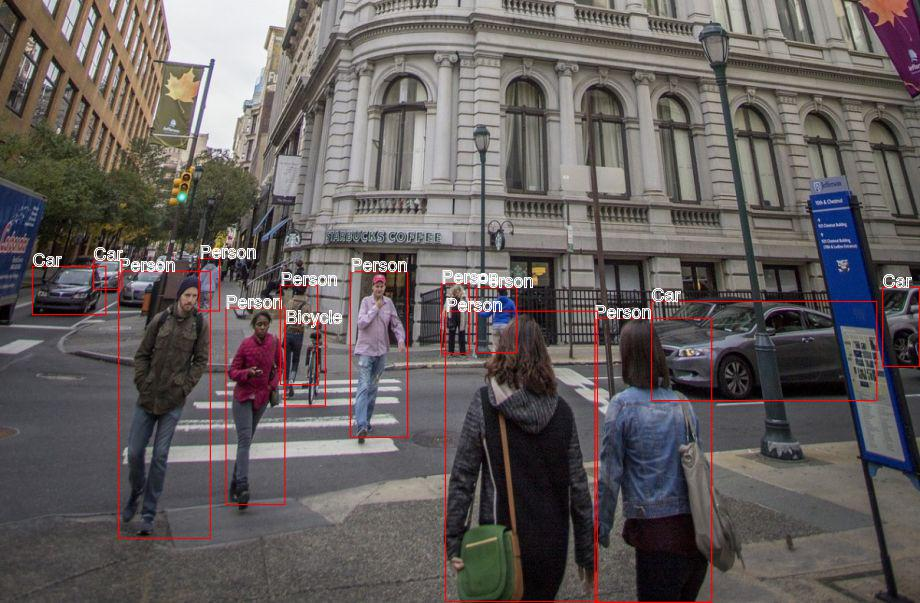

# aws-rekognition-playground

learn [AWS Rekognition](https://docs.aws.amazon.com/rekognition/)

see [`src/examples.js`](src/examples.js)

## Prerequisites

* [AWS default credentials](https://docs.aws.amazon.com/sdk-for-java/v1/developer-guide/credentials.html) available to call Rekognition API
* install imagemagick, graphicsmagick, and ghostscript (for fonts) for labelling image

    ```sh
    brew install imagemagick
    brew install graphicsmagick
    brew install ghostscript
    ```

## Example Labelled Image Using [`detectLabels`](https://docs.aws.amazon.com/AWSJavaScriptSDK/latest/AWS/Rekognition.html#detectLabels-property) API

**Source**


**Labelled**



## Running

`npm start`